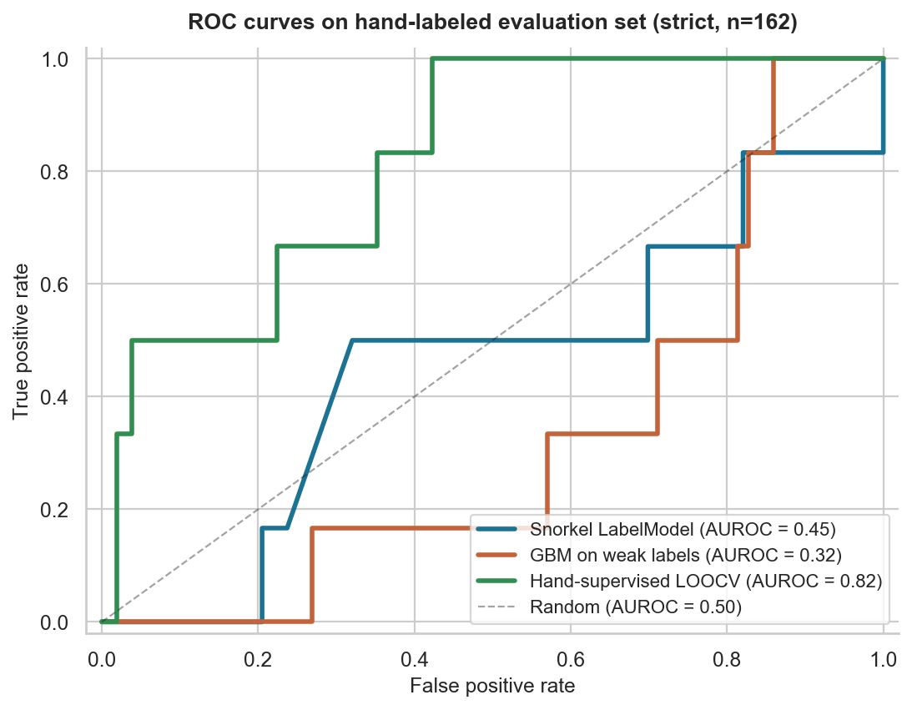

# FakeOut: Rental Scam Classifier

**Can programmatic weak supervision replace hand-labeled ground truth for rental fraud?**
On 99,467 US rental listings, the answer was no. Snorkel's labeling functions encoded
a wrong assumption ("cheap rent means scam"), and the models trained on them did worse
than random. A sparse logistic regression trained on just **165 hand-labeled listings**
reached **AUROC 0.82**.

📄 **[Read the paper (PDF)](paper/FakeOut.pdf)**, *FakeOut: Rental Scam Classifier*,
Prerana Anand, Saloni Patel and Andreas Jack Christiansen. CS 663 Foundations of
Machine Learning, University of San Francisco, Spring 2026.

## Results

Evaluated on 165 hand-labeled listings, gathered over six stratified sampling rounds.

| Model | Trained on | AUROC | AP | Top-10 | Top-50 |
|---|---|---|---|---|---|
| Snorkel LabelModel | 17 labeling functions | 0.45 | 0.04 | 0% | 8% |
| Gradient boosting | Snorkel's confident weak labels | 0.33 | 0.03 | 0% | 8% |
| **L1 logistic regression** | **165 hand labels (LOOCV)** | **0.82** | **0.21** | **30%** | **10%** |

<p align="center">
  
</p>

AUROC and AP are computed on the scam/not-scam cases; top-K counts "unsure" labels as
positives, since a reviewer would investigate them.

**Why weak supervision failed here:** the corpus is dominated by legitimate aggregator
listings (91% RentDigs.com). Their below-market floor prices, student housing and
Section 8 units all trigger the scam-leaning labeling functions. The noise wasn't
random, so it didn't average out. It compounded: the LabelModel was confidently wrong,
and the gradient-boosted model trained on its labels learned those mistakes more
confidently still.

## How it works

1. **Data.** The [UCI Apartments for Rent](https://doi.org/10.24432/C5X623) dataset
   (99,492 listings, no fraud labels) joined with the
   [Zillow Observed Rent Index](https://www.zillow.com/research/data/) at ZIP level.
2. **Market baselines.** Each listing is reverse-geocoded to its nearest ZIP (`pgeocode`
   and a haversine `BallTree`). Where ZORI has no value for that ZIP, a spatial k-NN
   takes the median of up to five ZORI ZIPs within 15 km, which adds 33% coverage.
   This yields `price_vs_zori_ratio`, a ZORI z-score and asymmetric anomaly flags.
3. **Effective-price recovery.** Aggregators often put the building's floor price in the
   `price` field, with the real range only in the body text ("rates range from $1,028 to
   $1,608"). Regex heuristics recover the effective price, so honest listings aren't
   flagged as too cheap.
4. **Weak supervision.** 17 labeling functions in four families (price/ZORI anomalies,
   luxury-bait heuristics, contact and urgency text, and legitimate-explanation voters),
   combined with Snorkel's `LabelModel`.
5. **Ground truth.** 165 listings hand-labeled across six targeted rounds: top-K by
   Snorkel score, the abstain zone, pattern probes and a "hunter" stratum that surfaced
   scams at 6.7% versus 1.1% for random sampling.
6. **Comparison.** All three models above are scored on the same hand-labeled set.

## Repository

| Path | What it is |
|---|---|
| `ML_Final_Project.ipynb` | The full pipeline: EDA, features, ZORI integration, labeling functions, the three models and the evaluation |
| `build_labeling_sample*.py` | Builds the stratified hand-labeling samples for each round |
| `scam_hunter.py` | Targeted "hunter" queries that surface likely scams for labeling |
| `labeling_sample*.csv` | The hand-labeled rounds |
| `apartments_for_rent_classified_100K.csv.zip` | UCI listings dataset |
| `Zip_zori_uc_sfrcondomfr_sm_month.csv` | Zillow ZORI, ZIP-level monthly |
| `roc_three_models.png` | The ROC comparison above |
| `paper/FakeOut.pdf` | The paper |

## Running it

```bash
pip install pandas numpy scikit-learn snorkel pgeocode matplotlib seaborn
unzip apartments_for_rent_classified_100K.csv.zip
jupyter notebook ML_Final_Project.ipynb
```

## Limitations

The true scam rate is unobserved. Random sampling suggests about 1%, and the aggregator
sources filter out obvious scams upstream. The hand-labeled set is small (n = 165) and
stratified toward anomalies, so absolute numbers reflect that harder slice, though the
ranking of the three models should hold. Production systems lean on account-level
signals (account age, login country, profile completeness) that this dataset doesn't
include.
